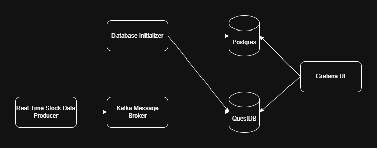

# Time Series Database and Real-Time Stock Analysis  

### My Interest in the Stock Market

I have a keen interest in the stock market, which led me to focus on real-time monitoring and analysis for timely decision-making. I started by exploring best practices, including selecting the right database and tools to support efficient market analysis.

## Database Selection  
Initially, I considered using a time series database as the core component of the stack. Having successfully used **TimescaleDB** in the past, I was confident in its capabilities. However, I came across **QuestDB**, which claimed better performance in benchmarks:  
[Comparing InfluxDB, TimescaleDB, and QuestDB](https://questdb.com/blog/comparing-influxdb-timescaledb-questdb-time-series-databases/)  

After testing QuestDB, I found it quite promising. The availability of plugins, such as **Kafka integration**, made it even more appealing. I tested Kafka with QuestDB, and it worked seamlessly, reinforcing my decision.  

## Event-Driven Architecture  
An alternative approach could have been **Spark Streaming**, but given the need for a quick decision, I opted for an **event-driven design** using Kafka. This allowed for real-time data ingestion and processing, aligning well with the project's goals.  

## UI Considerations  
For visualization, I chose **Grafana** due to its reliability and speed. However, since Grafana is primarily a **monitoring tool**, I wouldn't choose it again for this use case. Nevertheless, I decided to stick with it for the project.  

## Sentiment Analysis and Data Storage  
Since the analysis is **real-time**, I wanted to incorporate **sentiment analysis**. The sentiment data is structured as **large JSON objects** containing various text-based parameters. Initially, I considered **MongoDB** for storage, but **Grafana does not support MongoDB** in its open-source version. As a workaround, I stored the JSON data in **PostgreSQL** and queried it from there.  

## Analysis Features  
The system currently supports the following analytical functions:  

- **Stock Price Visualization:** Plot prices by symbol.  
- **Customizable Moving Averages:** Overlay moving averages on price charts.  
- **Intraday Price Changes:** Identify the biggest difference between opening and closing prices.  
- **Daily Average Return:** Compute the average return per day.  
- **Long-Term Price Changes:** Measure price changes from the earliest available data.  
- **Sentiment Analysis:** Calculate current **average relevance** and **sentiment scores**.  
- **News Insights:** Identify the **best** and **worst** news related to a stock.  

## Data Sources and Pipeline  
- **Data Providers:** The system retrieves stock data from **Finnhub** and **AlphaVantage**.  
- **Database Initialization:** A setup process populates the databases with historical data in the **Docker environment**.  
- **Real-Time Processing:** A dedicated component periodically generates new data and **publishes it via Kafka** to QuestDB for real-time updates.  


The data itself was gathered from Finnhub and Alphavantage for docker env there will be an initialization part which populate data in the databases. Then for real time producing there will be a component which creates data periodically and sends it via Kafka to the QuestDB.

### Application Visualization



### Dashboard Picture


## Running the application

### Prerequisites for Running the Dashboard

Before you can access the dashboard, ensure that the following prerequisites are met:

1. **Docker**: Make sure Docker is installed on your system. You can download it from the official Docker website:
   - [Download Docker](https://www.docker.com/get-started)

2. **Docker Compose**: Docker Compose is required to manage the multi-container setup. Install Docker Compose if it is not already installed. Follow the installation guide:
   - [Docker Compose Installation Guide](https://docs.docker.com/compose/install/)


### Required Ports

Before running the app, ensure the following ports are free:

- **2181** for Zookeeper
- **9092** and **9101** for the Broker
- **8083** for Kafka Connect
- **9000**, **9009**, **8812**, and **9003** for QuestDB
- **5432** for PostgreSQL
- **3000** for Grafana

Please check that no other applications are using these ports to avoid conflicts when starting the services.

To run the project go to the project folder and run the following command:

```bash
docker-compose -f dev-docker-compose.yml up
```

If you have docker installed on your machine it is done.

To open the dashboard follow the next link after about 1 minutes of initialization:

### Access the Dashboard

To open the dashboard, follow the link below after approximately 1 minute of initialization:

[Open Dashboard](http://localhost:3000/)

Please wait a moment while the system initializes.

## Final Thoughts  
While this stack effectively supports real-time analysis, future improvements could involve a more specialized **visualization tool** instead of Grafana and better handling of **sentiment data storage**. The event-driven approach has proven to be a solid choice, ensuring efficient and scalable data processing.  

### Future Improvments for the app
- Docker compose file should be fully parameterizable
- Add "Prod" Docker compose file
- Using Result pattern
- Add better error handling
- Add better telemetry, logging for application insights
- Use Kubernetes or else to manage different sources
- Maybe try an ETL pipeline or Data flow like Big Data concepts
